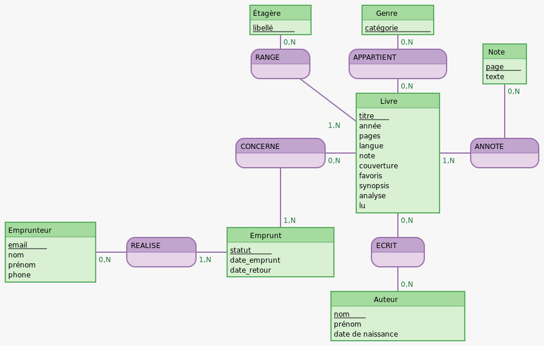

# MCD - ExLibrisDomus

## MCD Merise

Livre : titre, année, pages, langue, note, couverture, favoris, synopsis, analyse, lu  
Note : page, texte  
Auteur : nom, prénom, date de naissance  
Étagère : libellé  
Emprunteur : email, nom, prénom, phone  
Genre : catégorie  
Emprunt : statut, date_emprunt, date_retour

ANNOTE, 1N Livre, 0N Note  
ECRIT, 0N Livre, 0N Auteur  
RANGE, 1N Livre, 0N Étagère  
APPARTIENT, 0N Livre, 0N Genre  
CONCERNE, 1N Emprunt, 0N Livre  
REALISE, 1N Emprunt, 0N Emprunteur

---

## MCD Mocodo

```
:
:
Étagère : libellé
Genre : catégorie
:

:
:
RANGE, 1N Livre, 0N Étagère
APPARTIENT, 0N Livre, 0N Genre
Note : page, texte

:
:
CONCERNE, 1N Emprunt, 0N Livre
Livre : titre, année, pages, langue, note, couverture, favoris, synopsis, analyse, lu
ANNOTE, 1N Livre, 0N Note

Emprunteur : email, nom, prénom, phone
REALISE, 1N Emprunt, 0N Emprunteur
Emprunt : statut, date_emprunt, date_retour
ECRIT, 0N Livre, 0N Auteur
:

:
:
:
Auteur : nom, prénom, date de naissance
:
```

---

## Version schématique


