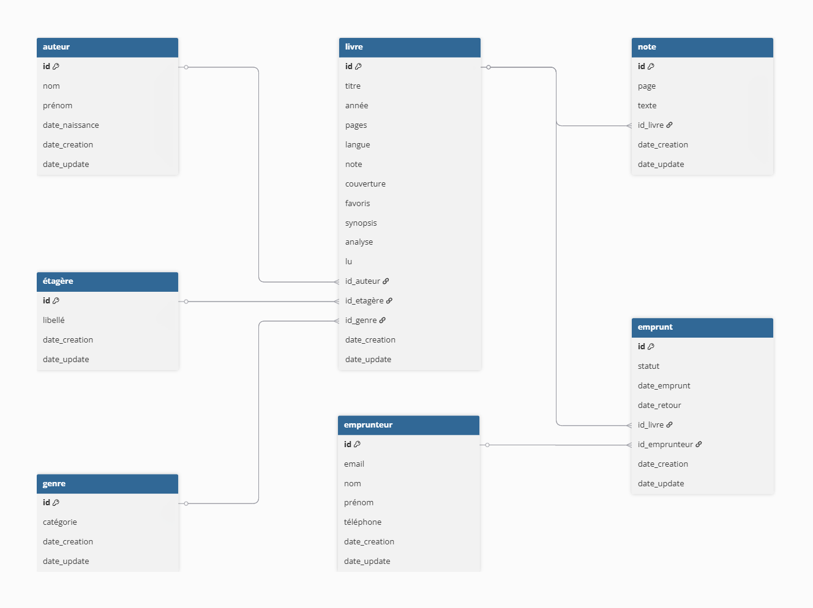

# MLD - ExLibrisDomus

### Livre

- **id** (PK, INT, GENERATED ALWAYS AS IDENTITY)
- titre (TEXT, NOT NULL)
- année (INT)
- pages (INT)
- langue (TEXT)
- note (INT, CHECK 1-5)
- couverture (TEXT) -- URL/chemin image
- favoris (BOOLEAN, DEFAULT FALSE)
- synopsis (TEXT)
- analyse (TEXT)
- lu (BOOLEAN, DEFAULT FALSE)
- **id_auteur** (FK → Auteur.id, ON DELETE SET NULL)
- **id_etagere** (FK → Étagère.id, ON DELETE SET NULL)
- **id_genre** (FK → Genre.id, ON DELETE SET NULL)
- date_creation (TIMESTAMPTZ, DEFAULT NOW())
- date_update (TIMESTAMPTZ)

### Note

- **id** (PK, INT, GENERATED ALWAYS AS IDENTITY)
- page (INT, NOT NULL)
- texte (TEXT)
- **id_livre** (FK → Livre.id, NOT NULL, ON DELETE CASCADE)
- date_creation (TIMESTAMPTZ, DEFAULT NOW())
- date_update (TIMESTAMPTZ)

### Auteur

- **id** (PK, INT, GENERATED ALWAYS AS IDENTITY)
- nom (TEXT, NOT NULL)
- prénom (TEXT)
- date_naissance (DATE)
- date_creation (TIMESTAMPTZ, DEFAULT NOW())
- date_update (TIMESTAMPTZ)

### Étagère

- **id** (PK, INT, GENERATED ALWAYS AS IDENTITY)
- libellé (TEXT, NOT NULL, UNIQUE)
- date_creation (TIMESTAMPTZ, DEFAULT NOW())
- date_update (TIMESTAMPTZ)

### Emprunteur

- **id** (PK, INT, GENERATED ALWAYS AS IDENTITY)
- email (TEXT, NOT NULL, UNIQUE)
- nom (TEXT, NOT NULL)
- prénom (TEXT)
- téléphone (TEXT)
- date_creation (TIMESTAMPTZ, DEFAULT NOW())
- date_update (TIMESTAMPTZ)

### Genre

- **id** (PK, INT, GENERATED ALWAYS AS IDENTITY)
- catégorie (TEXT, NOT NULL, UNIQUE)
- date_creation (TIMESTAMPTZ, DEFAULT NOW())
- date_update (TIMESTAMPTZ)

### Emprunt

- **id** (PK, INT, GENERATED ALWAYS AS IDENTITY)
- statut (TEXT, NOT NULL, CHECK IN ('en_cours','rendu','en_retard'))
- date_emprunt (DATE, NOT NULL)
- date_retour (DATE) -- NULL si pas encore rendu
- **id_livre** (FK → Livre.id, NOT NULL, ON DELETE RESTRICT)
- **id_emprunteur** (FK → Emprunteur.id, NOT NULL, ON DELETE RESTRICT)
- date_creation (TIMESTAMPTZ, DEFAULT NOW())
- date_update (TIMESTAMPTZ)

## Contraintes de référence

- Livre.id_auteur → Auteur.id (ON DELETE SET NULL)
- Livre.id_etagere → Étagère.id (ON DELETE SET NULL)
- Livre.id_genre → Genre.id (ON DELETE SET NULL)
- Note.id_livre → Livre.id (ON DELETE CASCADE)
- Emprunt.id_livre → Livre.id (ON DELETE RESTRICT)
- Emprunt.id_emprunteur → Emprunteur.id (ON DELETE RESTRICT)

## Index recommandés

- Index sur Livre.titre (recherche fréquente)
- Index sur Auteur.nom (recherche par auteur)
- Index sur Emprunt.statut (filtrage par statut)
- Index sur Emprunt.date_emprunt (tri chronologique)

---

## Version schématique

